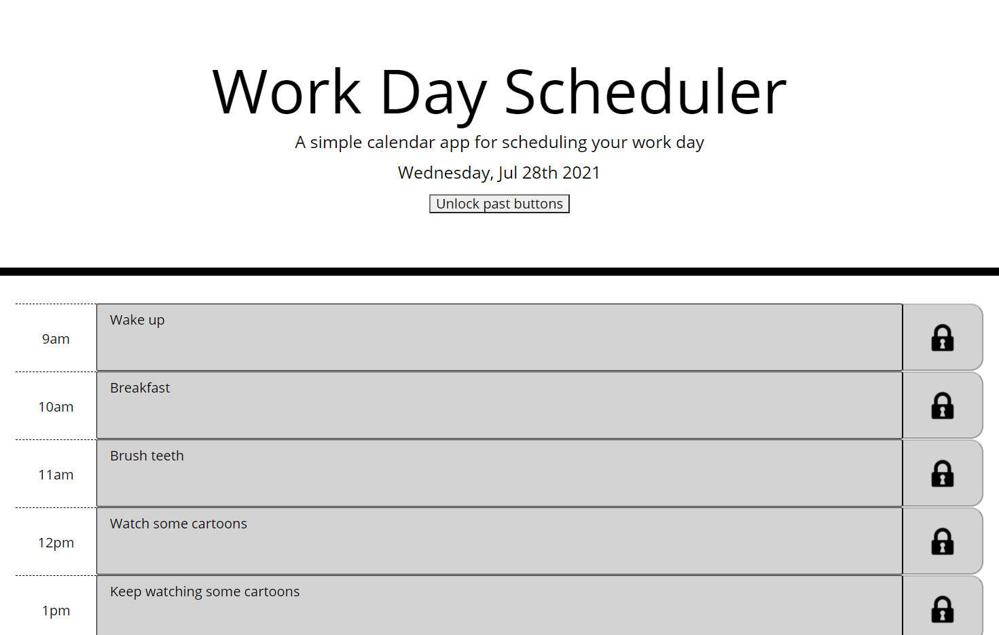
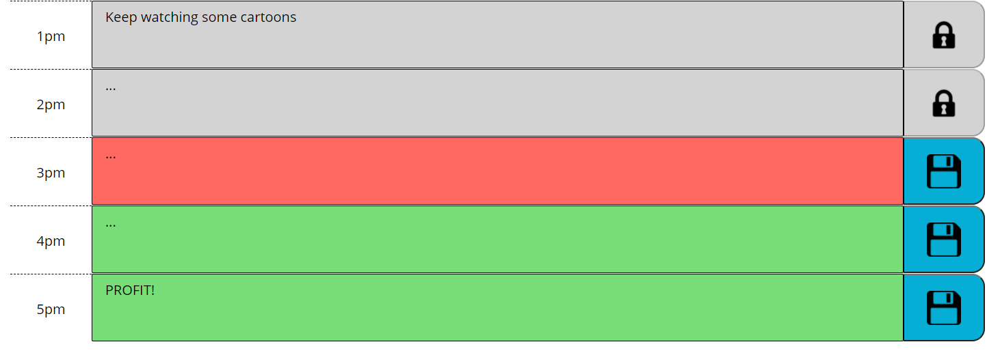
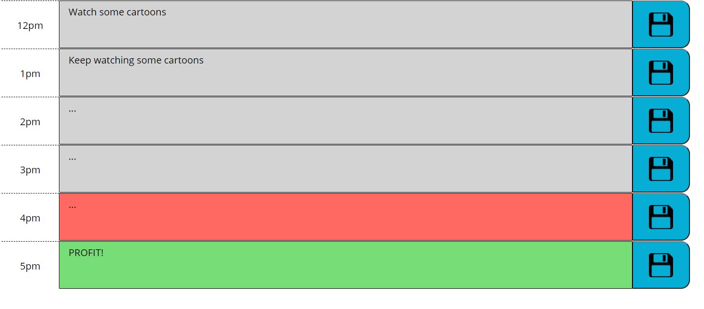

# 05 Third-Party-APIs
## Section 01: General Information
5th code Boot Camp assignment.

`Work Day Scheduler`

by Cristobal Hernandez

Published link: https://cristobalhdz.github.io/Schedule_5thWK/

# Section 02: General Information
The task is to make a day schedule with some starting code. We were given some HTML and CSS code and were expected to make and complete the JS code in its entirety. 

# Section 03: My experience
The majority of my first hours were doing some of the HTML and CSS manually. 
At some point I realized we were taught how to use Bootstrap and that the JS code would be better, and shorter, by using jQuery.

`HTML`
At the beginning of the HTML code, past the realization of the Bootstrap & jQuery, all the ids were called "9am","10am",etc; at some point during the code in JS I realized it was way easier to call them by the same strating name and just change some parts. That is why the ids are called "time9","time10",etc. It was easier just to parseInt and split to get a number.

`CSS`
Not a big deal, it was jsut adding classes where they belonged.

`JS/jQuery`
First of all, I decided to declare the "today's date" outside of the whole code. That part works by its own and it is cleaner just to leave it outside.

The transition from normal JS to jQuery was the real challenge for me in this project. Getting to know it is better to declare each variable as you go on, than declare it at the top was huge for my understanding. One thing that I am so glad I got the hang of how it works is the use of "this", normally I would use the same id over and over and with the ttag it was were easier.

Most of my time, 5-6 hours were spent researching how to make the id name-number separator(`timeList = parseInt($(this).attr('id').split("time")[1]);`). Once I got that, the other parts of the homework were a breeze, even the local sotrage which I had struggles last week.

For one last thing, I decided to add a little more challenge for me. Lines 41-59 are the lock/unlock buttons. If the hour has already passed, then the buttons will change icons and block the user for using them until the next day. Because people maybe want to plan their days ahead of time, then there is a button which when pressed unlocks all of the other buttons and viceversa in case you click it again.

# Section 04: Images

# References
`How to get current time in hours`
 
https://www.includehelp.com/code-snippets/get-current-time-in-hours24-minutes-seconds-format-in-javascript.aspx#:~:text=To%20get%20the%20current%20time%20in%20JavaScript%2C%20we,getSeconds%20%28%29%20Method%20%E2%80%93%20It%20returns%20current%20seconds

`Loop through elements and IDs`
 
https://www.geeksforgeeks.org/how-to-loop-through-input-elements-in-jquery/

`Loop thorugh elements and IDs 2`
 
https://www.codesd.com/item/jquery-loops-over-the-list-items-and-gets-the-value-of-the-data-imgid-attribute.html

`List of traversing elements`
 
https://www.tutorialsteacher.com/jquery/jquery-traversing-dom-elements

`Add class from jQuery`
 
https://www.w3schools.com/jquery/html_addclass.asp

`Trigger everything on load`
 
https://stackoverflow.com/questions/43262469/jquery-trigger-on-page-load

`Change the img's src`
 
https://coursesweb.net/jquery/add-change-remove-attribute-jquery
